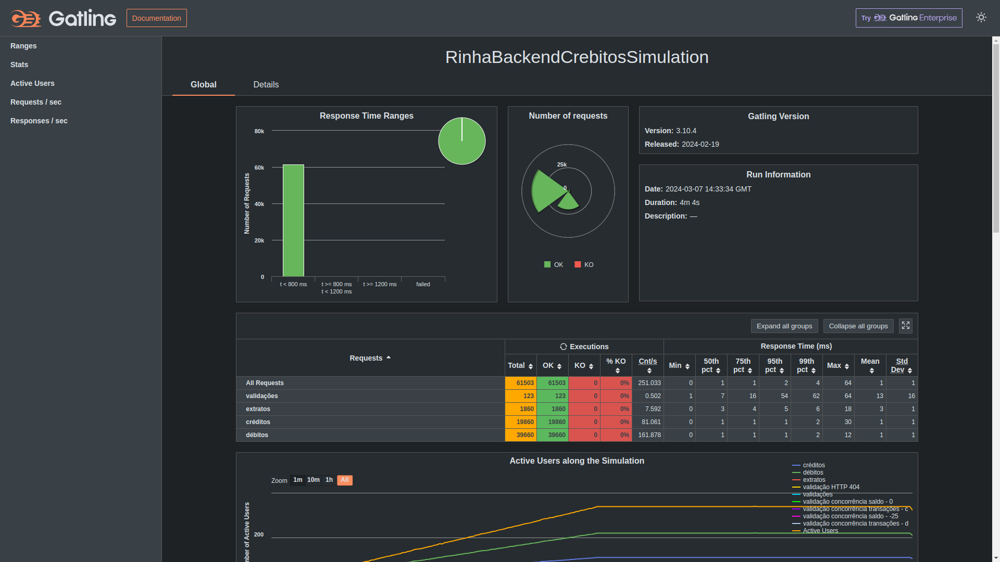

# Rinha Backend 2024-Q1: Crebito

## Nathan Bahia

### Disclaimer: O código apresentado aqui não deve nunca ser usado em produção!

API desenvolvida utlizando:
- Go - https://go.dev/
- Chi - https://go-chi.io/
- Postgres - https://www.postgresql.org/docs/
- Nginx - https://nginx.org/en/docs/

Minhas redes sociais:
- Github - https://github.com/nathanbahiadev
- LinkedIn - https://linkedin.com/in/nathanbahia
- Twitter - https://twitter.com/__nbdev__

